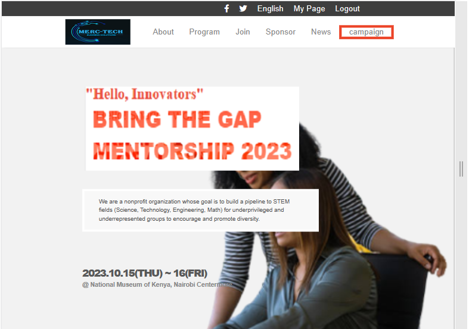
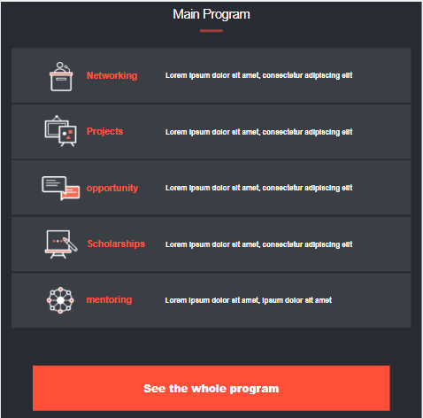
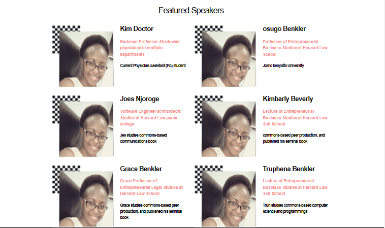

# Bridge the gap mentorship Page

This project aims at providing connections to STEM through mentors with relevant experience, exposure to various STEM fields, professional networking, hands-on projects among others.

## Contents

- Development
- Screen Shots
- Visit Website
- Built With
- Live Demo
- Contributors
- Author

## Development

The project was initialised using Html and CSS.

The mobile interaction Menu was set up using Javascript manipulation of elements.

The Speaker section was dynamically set up using Javascript.

Images were installed to bring out the aim of the project.

## Screen Shots

## Visit Website

[GitHub pages](https://mercymugambi.github.io/capstone_project_mentorshipProgram/)

## Built With

- HTML
- CSS
- Git & Gitflow
- Javascript
- Github pages for deployment

## Live Demo

[Live Demo link](https://www.loom.com/share/d3912d12f5b34ea28ee349eb21992d8d)

## Contributors

Original design by [Cindy Shin](https://www.behance.net/adagio07)

:bust_in_silhouette: **Author**

## Mercy Mugambi

- Github: [@mercymugambi](https://github.com/mercymugambi)
- Twitter: [@mercymugambi](https://twitter.com/mercymugambi15)
- Linkedin: [mercy mugambi](https://www.linkedin.com/in/mercymugambi)